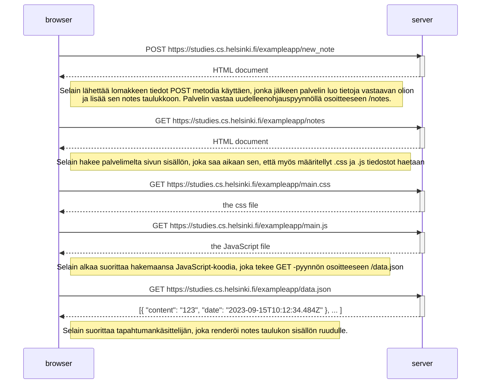

```mermaid
sequenceDiagram
    participant browser
    participant server
    
    browser->>server: POST https://studies.cs.helsinki.fi/exampleapp/new_note
    activate server
    server-->>browser: HTML document
    deactivate server

    Note right of browser: Selain lähettää lomakkeen tiedot POST metodia käyttäen, jonka jälkeen palvelin luo tietoja vastaavan olion<br> ja lisää sen notes taulukkoon. Palvelin vastaa uudelleenohjauspyynnöllä osoitteeseen /notes. 
    
    browser->>server: GET https://studies.cs.helsinki.fi/exampleapp/notes
    activate server
    server-->>browser: HTML document
    deactivate server

    Note right of browser: Selain hakee palvelimelta sivun sisällön, joka saa aikaan sen, että myös määritellyt .css ja .js tiedostot haetaan

    browser->>server: GET https://studies.cs.helsinki.fi/exampleapp/main.css
    activate server
    server-->>browser: the css file
    deactivate server
    
    browser->>server: GET https://studies.cs.helsinki.fi/exampleapp/main.js
    activate server
    server-->>browser: the JavaScript file
    deactivate server

    Note right of browser: Selain alkaa suorittaa hakemaansa JavaScript-koodia, joka tekee GET -pyynnön osoitteeseen /data.json
    
    browser->>server: GET https://studies.cs.helsinki.fi/exampleapp/data.json
    activate server
    server-->>browser: [{ "content": "123", "date": "2023-09-15T10:12:34.484Z" }, ... ]
    deactivate server   

    Note right of browser: Selain suorittaa tapahtumankäsittelijän, joka renderöi notes taulukon sisällön ruudulle.

```